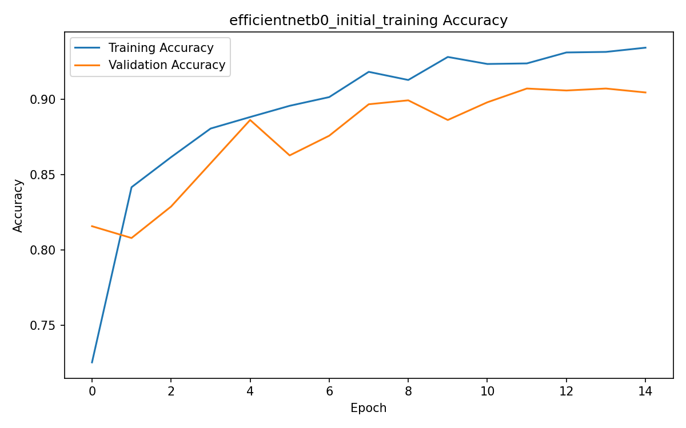
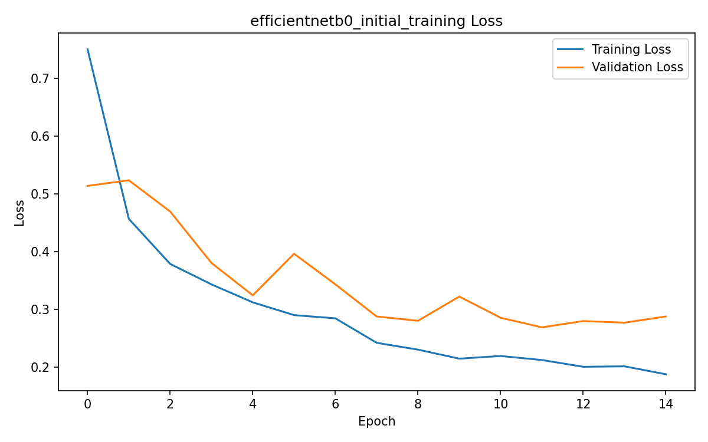
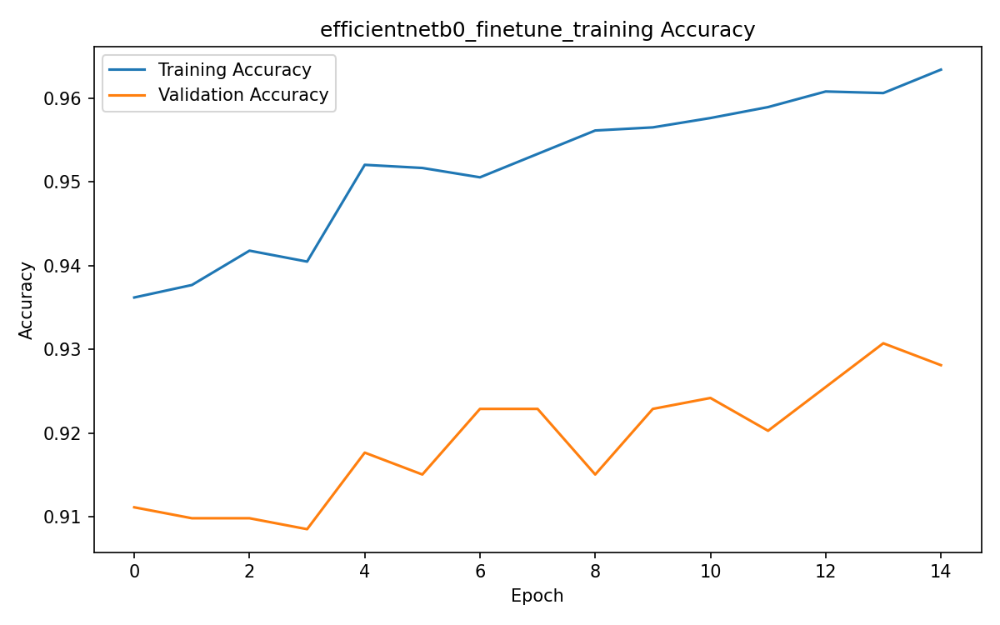
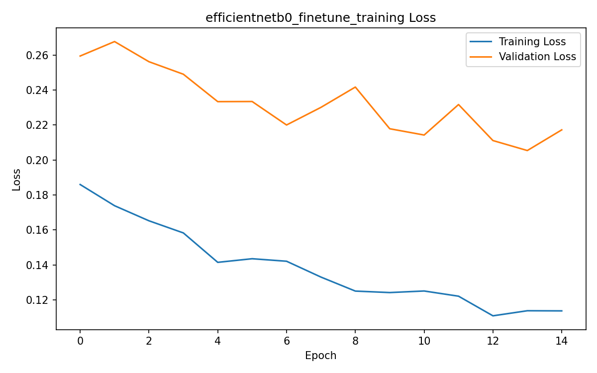
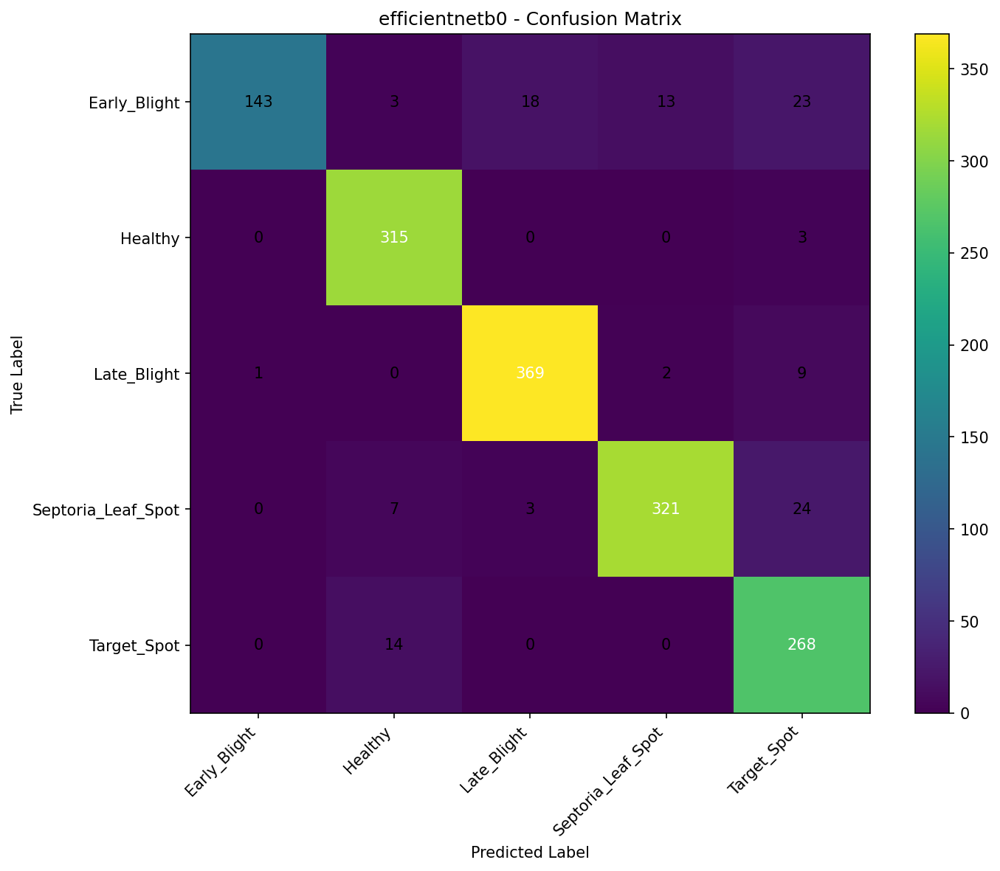

# Plant Disease Detection

🚀 [Live Demo](https://plant-disease-detection68.streamlit.app/)
A deep learning-based computer vision system for classifying tomato leaf images into five tomato leaf disease and health categories using TensorFlow, Keras, and EfficientNetB0.

The project includes model training, fine-tuning, independent test-set evaluation, performance analysis, and a Streamlit web application for image-based prediction.

> Educational and research use only. This system is not intended to replace professional agricultural diagnosis.

## Overview

This project implements a complete tomato leaf image classification workflow based on transfer learning with EfficientNetB0.

### Key Features

- Five-class tomato leaf classification
- Duplicate removal during dataset preparation
- Leakage-free train, validation, and test splitting
- Image preprocessing and augmentation
- ImageNet-pretrained EfficientNetB0
- Two-stage training and partial fine-tuning
- Frozen Batch Normalization layers during fine-tuning
- Independent test-set evaluation
- Accuracy, precision, recall, and F1-score metrics
- Classification report
- Confusion matrix
- Training history and performance plots
- Reproducible random seed
- Streamlit prediction interface
- Top-3 predictions and class probabilities

## Supported Classes

| Label | Class |
|---:|---|
| 0 | Early_Blight |
| 1 | Healthy |
| 2 | Late_Blight |
| 3 | Septoria_Leaf_Spot |
| 4 | Target_Spot |

## Dataset

The project uses the tomato disease subset of the PlantVillage dataset.

The dataset was prepared by removing duplicate images before creating the final dataset split.

### Dataset Distribution

| Class | Images |
|---|---:|
| Early_Blight | 1,000 |
| Healthy | 1,585 |
| Late_Blight | 1,901 |
| Septoria_Leaf_Spot | 1,771 |
| Target_Spot | 1,404 |
| Total | 7,661 |

### Dataset Split

A fixed random seed of 123 was used for reproducibility.

| Split | Images | Percentage |
|---|---:|---:|
| Training | 5,360 | 70% |
| Validation | 765 | 10% |
| Test | 1,536 | 20% |
| Total | 7,661 | 100% |

The final test set contains 1,536 images.

The exact test-set paths and labels are recorded in `results/data_split.json`.

### Dataset Availability

This project uses a prepared tomato disease subset of the [PlantVillage Dataset](https://github.com/spMohanty/PlantVillage-Dataset).

The dataset was prepared by selecting the five tomato classes used by the project, removing duplicate images, creating a reproducible train/validation/test split, and verifying that there is no image overlap between the splits.

The final prepared dataset contains **7,661 images**:

| Split | Images |
|---|---:|
| Training | 5,360 |
| Validation | 765 |
| Test | 1,536 |
| **Total** | **7,661** |

The image dataset is **not included in this repository** because of its size and is intentionally excluded through `.gitignore`.

For local training and full test-set evaluation, place the prepared dataset under:

`data/split/`

with the following structure:

`train/`, `validation/`, and `test/`, each containing:

- `Early_Blight/`
- `Healthy/`
- `Late_Blight/`
- `Septoria_Leaf_Spot/`
- `Target_Spot/`

**Dataset source:** [PlantVillage Dataset](https://github.com/spMohanty/PlantVillage-Dataset)

**Original research paper:** Mohanty, S. P., Hughes, D. P., & Salathé, M. (2016). *Using Deep Learning for Image-Based Plant Disease Detection.* Frontiers in Plant Science, 7, 1419.

DOI: https://doi.org/10.3389/fpls.2016.01419

## Model

### ⭐ Final Model

**Final trained model:** `models/efficientnetb0.keras`

This is the **final EfficientNetB0 model** used by the Streamlit application for image prediction.

The model uses ImageNet-pretrained weights and was fine-tuned for the five tomato leaf classes supported by this project.

The final classifier uses EfficientNetB0 initialized with ImageNet-pretrained weights.

### Architecture

Input: 128 x 128 x 3

EfficientNetB0 Backbone
→ Global Average Pooling
→ Dense(128, ReLU)
→ Dropout(0.40)
→ Dense(5, Softmax)

### Training Strategy

Training is performed in two stages.

#### Stage 1 - Initial Training

- EfficientNetB0 backbone frozen
- Classification head trained first
- Adam optimizer
- Learning rate: 1e-3
- Data augmentation enabled
- Early stopping
- Learning-rate reduction

#### Stage 2 - Fine-Tuning

The backbone is partially unfrozen for additional training.

- Learning rate: 1e-5
- Earlier backbone layers remain frozen
- Batch Normalization layers remain frozen
- Best validation weights are restored

### Image Augmentation

The training pipeline uses:

- Random horizontal flipping
- Random rotation
- Random zoom
- Random contrast adjustment

## Final Test Performance

The final EfficientNetB0 model was evaluated on 1,536 independent test images.

| Metric | Score |
|---|---:|
| Accuracy | 92.19% |
| Weighted Precision | 92.76% |
| Weighted Recall | 92.19% |
| Weighted F1-Score | 92.05% |
| Macro Precision | 92.87% |
| Macro Recall | 90.57% |
| Macro F1-Score | 91.13% |
| Test Loss | 0.2285 |

### Per-Class Performance

| Class | Precision | Recall | F1-Score | Support |
|---|---:|---:|---:|---:|
| Early_Blight | 0.99 | 0.71 | 0.83 | 200 |
| Healthy | 0.93 | 0.99 | 0.96 | 318 |
| Late_Blight | 0.95 | 0.97 | 0.96 | 381 |
| Septoria_Leaf_Spot | 0.96 | 0.90 | 0.93 | 355 |
| Target_Spot | 0.82 | 0.95 | 0.88 | 282 |

The complete classification report is available in `results/evaluation/efficientnetb0_classification_report.txt`.

Evaluation metrics are also stored in:

- `results/evaluation/efficientnetb0_evaluation.json`
- `results/evaluation/model_evaluation.json`

## Results and Visualizations

### Training Results

The following plots show the training and validation performance during model development.

#### Initial Training

#### Fine-Tuning

### Evaluation Results

The confusion matrix below provides a visual summary of the final model predictions across the five supported classes.

## Project Structure

plant-disease-detection/
- app.py
- train_model.py
- evaluate_model.py
- requirements.txt
- LICENSE
- README.md
- .gitignore
- models/
  - class_names.json
  - efficientnetb0.keras
  - efficientnetb0_initial_best.keras
- results/
  - data_split.json
  - model_summaries.txt
  - efficientnetb0_initial_training_accuracy.png
  - efficientnetb0_initial_training_loss.png
  - efficientnetb0_initial_training_history.json
  - efficientnetb0_finetune_training_accuracy.png
  - efficientnetb0_finetune_training_loss.png
  - efficientnetb0_finetune_training_history.json
  - evaluation/
    - efficientnetb0_classification_report.txt
    - efficientnetb0_confusion_matrix.png
    - efficientnetb0_evaluation.json
    - model_evaluation.json
    - model_comparison.csv

The dataset directories under `data/split/` are intentionally excluded from Git tracking.

## Installation

Clone the repository:

`git clone https://github.com/qamarsobhy7-source/plant-disease-detection.git`

Then:

`cd plant-disease-detection`

Install dependencies:

`pip install -r requirements.txt`

### Requirements

The project uses:

- Python
- TensorFlow
- Keras
- NumPy
- Scikit-learn
- Matplotlib
- Streamlit
- Pillow

Exact package versions are specified in `requirements.txt`.

## Training

Prepare the dataset under `data/split/` with the required train and validation directories.

Run:

`python train_model.py`

The training script:

1. Loads the prepared training and validation data.
2. Builds the EfficientNetB0 classifier.
3. Performs initial training with the backbone frozen.
4. Performs partial fine-tuning.
5. Saves training histories and plots.
6. Saves the final model as `models/efficientnetb0.keras`.

## Evaluation

For full independent test-set evaluation, the test images must exist under `data/split/test/`.

Run:

`python evaluate_model.py`

The evaluation script uses the recorded test split in `results/data_split.json`.

It generates:

- Test accuracy
- Precision
- Recall
- F1-score
- Classification report
- Confusion matrix
- JSON evaluation metrics
- Evaluation summary CSV

## Streamlit Application

The project includes a Streamlit interface for interactive image prediction.

Run:

`streamlit run app.py`

The application:

- Accepts a tomato leaf image
- Preprocesses the image to 128 x 128
- Loads the trained EfficientNetB0 model
- Predicts the most likely class
- Displays prediction confidence
- Displays the top-3 predictions
- Displays probabilities for all supported classes
- Applies a confidence threshold for prediction interpretation

The application uses:

- `models/efficientnetb0.keras`
- `models/class_names.json`

## Reproducibility

The project uses a fixed random seed:

`SEED = 123`

Important experiment information is preserved in the repository, including:

- Dataset class distribution
- Test-set paths and labels
- Model architecture
- Training configuration
- Training histories
- Evaluation metrics
- Classification report
- Confusion matrix

The dataset itself is not stored in the repository.

## Limitations

- The project focuses on five tomato leaf classes only.
- The dataset is based on PlantVillage imagery and may not fully represent real-world field conditions.
- Images with different lighting, backgrounds, cameras, or disease stages may produce different results.
- Performance differs between classes.
- Early_Blight has lower recall than the other classes.
- Target_Spot has lower precision than the other classes.
- The system should not be treated as a professional agricultural diagnostic tool.

## Future Improvements

Possible future improvements include:

- Larger real-world field datasets
- Higher-resolution image inputs
- Additional tomato diseases and plant species
- Stronger class-balancing strategies
- Advanced augmentation techniques
- Probability calibration
- Grad-CAM explainability
- REST API deployment
- Mobile application deployment
- Model monitoring and production evaluation

## Disclaimer

This project is intended for educational and research purposes only.

Predictions should not be considered professional agricultural advice or a definitive diagnosis of plant disease.

## License

This project is distributed under the license included in the `LICENSE` file.
